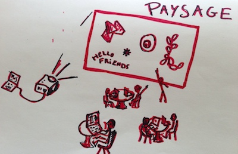
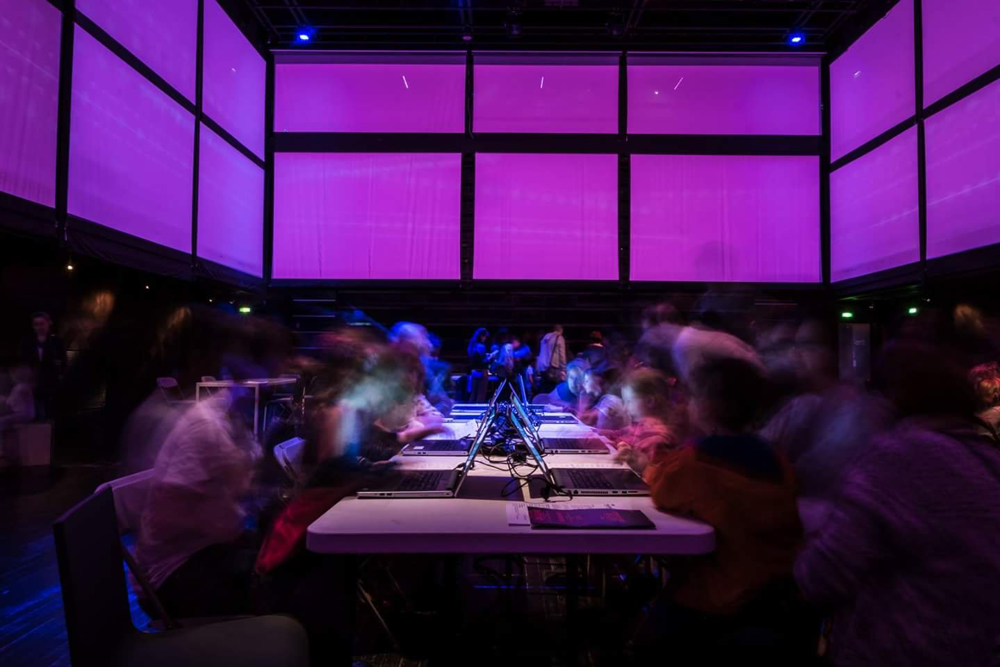
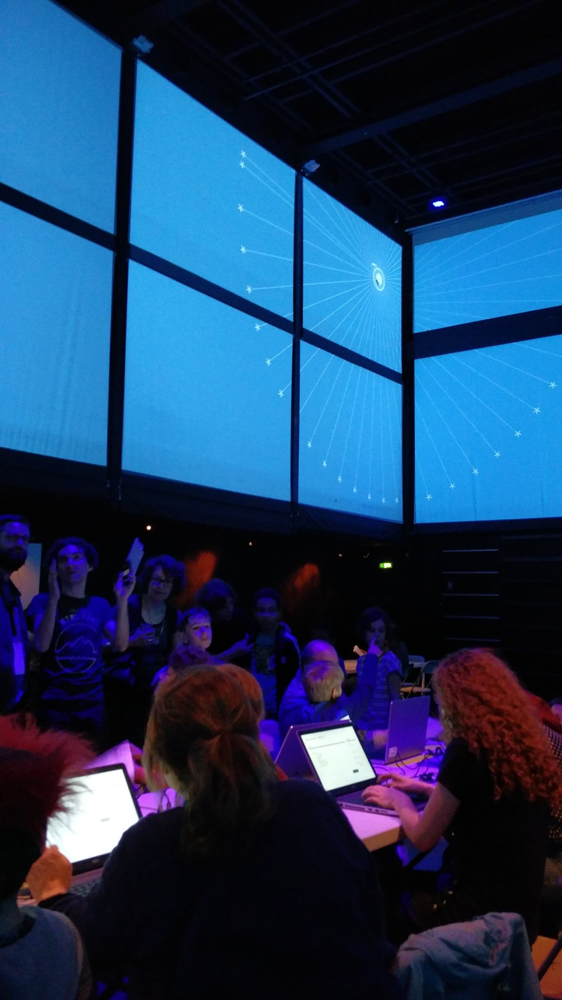

Paysage
=======
### ***Paysage*** *is a visual shared playground for code.* 

With Paysage kids, beginners and creative coders can live code from their own computer, laptop, tablet, or phone using a variety of IDEs and editors. 
Pieces of code that we call 'code objects' are sent and rendered live on a visual playground accessible via an URL.

The Paysage project does not try to invent a new IDE or code editor for creative coding or beginners, nor a new programming language. There are already many editors and languages, with more launching everyday.

Paysage is about making possible a very specific coding experience: 
**Let 10 people of any level or age code together in the same room –with a few more online– on the same visual playground.**

### Demo

[http://paysage.xyz/playground/boumsplash/](http://paysage.xyz/playground/boumsplash/) (a playground named "boumsplash"!)  
[http://paysage.xyz/playground/boumsplash/programmer](http://paysage.xyz/playground/boumsplash/programmer) (a basic default code editor for the boumsplash playground. The plan is to allow any other editor, including desktop editors or apps.) 

- Open both pages (on several different computers for more fun. You of course can open the playground view on a phone or tablet too.), 

 - Write ProcessingJS code on the programmer, click the [Go live!] button to send your code to the playground. Your code is assigned a unique name (the editor defaults to a random word, but you can change it to anything you want).
 - Or, click a thumbnail to load an example, and click the [Go live!] button to send your code to the playground. 
 - Code objects are listed: click the links to load an existing object, change its name to create a new object derived from it.

- Ask a friend to open another [programmer page for boumsplash](http://paysage.xyz/playground/boumsplash/programmer) to code together on the same [playground](http://paysage.xyz/playground/boumsplash/)

(Code objects are saved server-side but only in-memory. No disk or database persistence for now. As we are using a free Heroku instance, code is lost whenever the server is shutdown by Heroku for inactivity)

A list of active Playgrounds to join can be found at http://paysage.xyz/list

### Note on the collaborative vision of Paysage:

Paysage does not impose social rules on the users. Anyone can edit everything if they want to! 

Just like writing on Etherpad or Google Docs, users have to evolve their own social rules according to their goals and needs. Yes, pranks and edit wars will happen :-) but it’s part of the process. 

In a sandbox (the real one at the park :-) a kid can destroy the castle another built, and it's the role of other kids and adults to build their own rules about what is allowed and what is not.

In that sense **Paysage is a playground to learn and explore open collaboration.**

### Contributing

#### Install and run locally

    git clone https://github.com/jonathanperret/paysage.git
    cd paysage
    npm install
    npm start

Then browse <http://localhost:3000/>.

If the Programmer or Playground miss the javascript third-party libraries dependencies, make sure that Bower has been installed on your computer and then run `bower install` in the paysage directory. It will pull the javascript libraries needed on the front end.
(`npm install` should install and run bower, but depending on your configuration, you may have fallen into a weird state :-)

#### How to summit a contribution

Before summiting your pull request, please run the tests:

    npm test

If you get a lint error you can fix it using the following procedure:

    npm run lint -- --fix && git commit -a --amend --no-edit && npm test

#### Deployment on www.paysage.xyz

The demo is continuously deployed from the GitHub repository, so your pull requests are welcome, and will be live in minutes once accepted :-)

#### Server, Playground, Editor(s)  

The **Paysage server** is a NodeJs / Express app that both listens to the programmer page for new code and sends code to the renderer using socket.io. Fallbacks from WebSockets to older techniques are really useful here, because sadly WebSockets are blocked on many institutions' networks where we tried Paysage: museums, universities…

The **Paysage playground** (renderer) is a JS HTML CSS page using Processing.js. 
Each code object is run as a separated Processing.js instance. As Processing.js leaves JS code alone, a code object can load and use other rendering libraries like two.js, d3.js, allowing participants to mix and match, and to code their objects using their favorite library.

**Paysage code editors** implementations will ideally be in a variety of languages that compile or interpret to javascript, and could be purely textual editors or visual editors or anything in between. 

At the moment, we use [Ace](https://ace.c9.io/) as the text editor: [http://paysage.xyz/playground/boumsplash/programmer](http://paysage.xyz/playground/boumsplash/programmer), communicating with the server using socket.io.

In the future we would like to have, for example:
 - A block-based editor based on Snap!, Blocky from Google or BlockLanguages.  
 - A local folder-watcher app for text editors that would push code to the Paysage server at each file save. 
 - An Etherpad based editor could allow several persons to code together on the same code object, multiplying the collaborative aspect even more.
 - An editor for babies on tablets, using only shapes to touch would be very cool to have, too. 
 - A Python or Logo-based editor would bring the positive aspects of these languages for beginners to Paysage.
 - and more way to send code to a Paysage playground, the ways ***you*** would want to edit code in Paysage…

#### Additional information on the wiki 
https://github.com/jonathanperret/paysage/wiki

##### Protocol and data exchange
https://github.com/jonathanperret/paysage/wiki/Technical-documentation

##### Workshops
Paysage has been already been used as the platform for workshops and creative coding classes.
[https://github.com/jonathanperret/paysage/wiki/Workshops
](https://github.com/jonathanperret/paysage/wiki/Workshops)

*An example is the Code Créatures workshop that took place at Pompidou Center during La Fête du Code Créatif (Creative Coding Party/Fest) on November 28th-29th 2015:*

##### Multi-screens
There's an how-to on the wiki explaining how to make your sketches multi-screen ready, so your they can spans multiple, separate playground (each one appearing shifted from the others)

[https://github.com/jonathanperret/paysage/wiki/Multi-screen
](https://github.com/jonathanperret/paysage/wiki/Multi-screen)

*Here are images of a Code Creatures workshop making use of this technique at La Gaité in Paris, with 4 different Playground page working as a single 360º screen*
 

#### TO DO

- [Create **simpler code examples**, that are easier to use as starting points for users](https://github.com/jonathanperret/paysage/issues/97), with clearer paths of improvement and modifications (more hackable).
- [code objects for a playground should be persistent and reloaded from the server](https://github.com/jonathanperret/paysage/issues/5)
- [any client editor should be able communicate with the server using a simple HTTP API](https://github.com/jonathanperret/paysage/issues/7)
  - for example [a local script could sync objects and local files](https://github.com/jonathanperret/paysage/issues/14) 
- more on the issue tracker:  https://github.com/jonathanperret/paysage/issues
