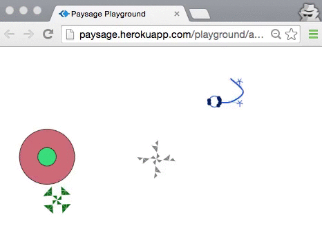

Paysage
=======
### ***Paysage*** *is a visual shared playground for code.* 

With Paysage kids –and adults!– live code from their own computer, laptops, tablets, phones, using a variety of IDE and editors. 
Pieces of code that we call 'code objects' are send and rendered live on a visual playground, accessible via an URL.

The Paysage project do not try to invent a new IDE or code editor for kids. There are already many editors, with more launching everyday.

Paysage is about making possible a very specific coding experience: 
**Let 10 kids in the same room, with a few more kids online, code together on the same visual playground.**

========
###Demo

[http://paysage.xyz/playground/boumsplash/](http://paysage.xyz/playground/boumsplash/) (a playground named "boumsplash"!)  
[http://paysage.xyz/playground/boumsplash/programmer](http://paysage.xyz/playground/boumsplash/programmer) (a basic default code editor for the boumsplash playground. The plans is to allow any other editor, including desktop editors or apps.) 

- Open both pages (on several different computers for more fun. You of course can open the playground view on a phone or tablet too.), 

 - Write ProcessingJS code on the programmer, click the [Go live!] button to send your code to the playground. Your code is assigned a unique name (the editor defaults to a random word, but you can change it to anything you want).
 - Or, click a thumbnail to load an example, and click the [Go live!] button to send your code to the playground. 
 - Code objects are listed: click the links to load an existing object, change its name to create a new object derived from it.

- Ask a friend to open another [programmer page for boumsplash](http://paysage.xyz/playground/boumsplash/programmer) to code together on the same [playground](http://paysage.xyz/playground/boumsplash/)

(Code objects are saved server-side but only in-memory. No disk or database persistence for now, so code is lost when server is shutdown, for example by Heroku for inactivity)

The demo is continuously deployed from the GitHub repository, so your pull requests are welcome, and will be live in minutes once accepted :-)

========
### Install and run locally

    git clone https://github.com/jonathanperret/paysage.git
    cd paysage
    npm install
    npm start

Then browse <http://http://127.0.0.1:3000/>.

========
#### Server, Playground, Editor(s)
The **Paysage server** is a NodeJs / Express app that both listen to the programmer page for new code and send code to the renderer using socket.io.

The **Paysage playground** (renderer) is a JS HTML CSS page using Processing.js. 
Each code object is run as one separated Processing.js instance.

**Paysage code editors** implementations will ideally be in a variety of languages that compile or interpret to javascript, and could be purely textual editors or visual editors or anything in between. For example :
 - A block-based editor based on Snap!, Blocky from Google or BlockLanguages.  
 - A local folder-watcher app for text editors could push code to the Paysage server at each file save. 
 - An Etherpad based editor could allow several persons to code together on the same code object.
 - An editor for babies on tablets, using only shapes to touch would be very cool, too. 
 
*At the moment, we use a simple HTML page as the test editor: [http://paysage.xyz/playground/boumsplash/programmer](http://paysage.xyz/playground/boumsplash/programmer)*, communicating with the server using socket.io 

======

####Note on the collaborative vision of Paysage:

Paysage do not impose social rules on the users. Anyone can edit everything if they want to! 

Just like writing on Etherpad or Google Docs, users have to evolve their own social rules according to their goals and needs. Yes, pranks and edit wars will happen :-) but it’s part of the process. 

In a sandbox (the real one at the park :-) a kid can destroy the castle another built, and it's the role of other kids and adults to build their own rules about what is allowed and what is not.

In that sense **Paysage is a playground to learn and explore open collaboration.**

=======

####TO DO

- Create beautiful and simple *code creatures* to serve as examples and starting points for users. 
- [code objects for a playground should be persistent and reloaded from the server](https://github.com/jonathanperret/paysage/issues/5)
- [any client editor should be able communicate with the server using a simple HTTP API](https://github.com/jonathanperret/paysage/issues/7)
  - for example [a local script could sync objects and local files](https://github.com/jonathanperret/paysage/issues/14) 
