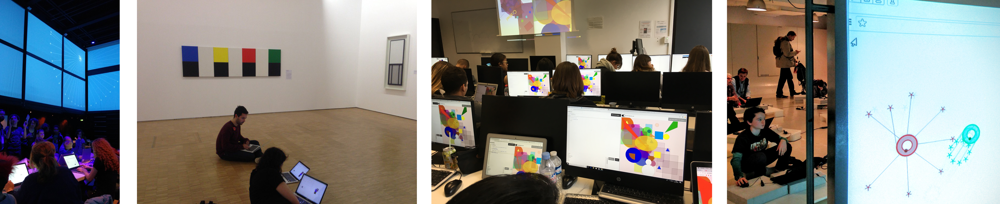
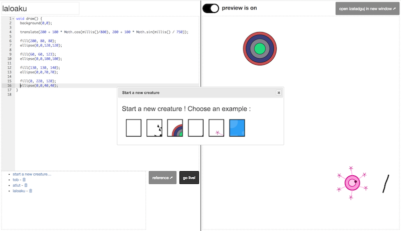

Paysage
=======
### ***Paysage*** *is a visual shared playground for code.* 

With Paysage several creative coders can live-code together on the same visual playground, using only web browsers. Snippets of code that we call 'code objects' or 'creatures' are sent and all rendered live, together on a visual playground accessible via an URL.

Paysage allows a very special coding experience: a dozen people, be it kids, beginners, artists or professionals, coding together in the same room… with maybe even a few more remote, creating a collective, collaborative, and evolving creation.

Paysage is a sandbox with no fixed social rules. Everyone can see, edit, copy and even delete others' code. As in a real sandbox, the users themselves have to invent and reinvent the rules to play well together. Paysage in this sense is also a way to put front and center how ***programming at its core is a social activity***.

Paysage is an open source platform, and has been used as the platform for the Code Créatures workshop at Pompidou Center and at La Gaité Lyrique. It has been tested as a collective code-sketching tool in a museum room, replacing the traditional paper and pencil. It is also used to teach an introductory creative coding class to students at communication and web marketing (!) schools, with sometimes up to 25 beginner students all coding on the same playground. Creative chaos guaranteed ;-)

### Try it! 

[http://paysage.xyz/playground/boumsplash/](http://paysage.xyz/playground/boumsplash/) is a playground named "boumsplash", because it's a fun name! (You can choose any name).  
 - Open the Playground page **full-screen on a computer connected to a videoprojector** or on tablet in the middle of a big table. **It's a collective visual space for creative code.**

 - [http://paysage.xyz/playground/boumsplash/programmer](http://paysage.xyz/playground/boumsplash/programmer) is the default online code editor for the boumsplash playground. (The plan is to allow any other editor to contribute to a Playground, including desktop editors or apps).  **Open the Programmer page on your computer** or tablet (keyboard preferred).

 - **Ask a friend** to open another [programmer page for boumsplash](http://paysage.xyz/playground/boumsplash/programmer) to code together on the same [playground](http://paysage.xyz/playground/boumsplash/)

The more people and the more computers that open the Programmer, the more fun it is (the record as of october 2017 is 22 students :-)

 - Write Processing.js code on the programmer, **click the [Go live!] button to send your code to the playground.** Your code is assigned a unique name (the editor defaults to a random word, but you can change it to anything you want).
 - Click a thumbnail at the bottom to load an example, and click the [Go live!] button to send your code to the playground. 
 - Code objects are listed: click the links to load an existing object, change the name of the loaded code to create a new object derived from it.

(Code objects are saved server-side but only in-memory. No disk or database persistence for now. As we are using a free Heroku instance, code is lost whenever the server is shutdown by Heroku for inactivity)  

### How to join Playgrounds and Programmer pages?

A list of active Playgrounds to join can be found at http://paysage.xyz/list

Going to http://paysage.xyz/ will automatically create a new playground for you and redirect you to this new playground's Programmer page. You can then share the URL for others to join you.

You can also choose the name of your new playground by using the name you want in the URL : http://paysage.xyz/playground/NAME-I-WANT/ and http://paysage.xyz/playground/NAME-I-WANT/programmer. A new playground will be created for you to play in—but you have to replace NAME-I-WANT by the name you actually want ;-)

### Note on the collaborative vision of Paysage:

Paysage does not impose social rules on the users. Anyone can edit everything if they want to! 

Just like writing on Etherpad or Google Docs, users have to evolve their own social rules according to their goals and needs. Yes, pranks and edit wars will happen :-) but it’s part of the process. 

In a sandbox (the real one at the park :-) a kid can destroy the castle another built, and it's the role of other kids and adults to build their own rules about what is allowed and what is not.

In that sense **Paysage is a playground to learn and explore open collaboration.**

### Contributing

#### Install and run locally

    git clone https://github.com/jonathanperret/paysage.git
    cd paysage
    npm install
    npm start

Then browse <http://localhost:3000/>.

If the Programmer or Playground miss the javascript third-party libraries dependencies, make sure that Bower has been installed on your computer and then run `bower install` in the paysage directory. It will pull the javascript libraries needed on the front end.
(`npm install` should install and run bower, but depending on your configuration, you may have fallen into a weird state :-)

#### How to summit a contribution

Before summiting your pull request, please run the tests:

    npm test

If you get a lint error you can fix it using the following procedure:

    npm run lint -- --fix && git commit -a --amend --no-edit && npm test

#### Deployment on www.paysage.xyz

The demo is continuously deployed from the GitHub repository, so your pull requests are welcome, and will be live in minutes once accepted :-)

#### Server, Playground, Editor(s)  

The **Paysage server** is a NodeJs / Express app that both listens to the programmer page for new code and sends code to the renderer using socket.io. Fallbacks from WebSockets to older techniques are really useful here, because sadly WebSockets are blocked on many institutions' networks where we tried Paysage: museums, universities…

The **Paysage playground** (renderer) is a JS HTML CSS page using Processing.js. 
Each code object is run as a separated Processing.js instance. As Processing.js leaves JS code alone, a code object can load and use other rendering libraries like two.js, d3.js, allowing participants to mix and match, and to code their objects using their favorite library.

**Paysage code editors** implementations will ideally be in a variety of languages that compile or interpret to javascript, and could be purely textual editors or visual editors or anything in between. 

At the moment, we use [Ace](https://ace.c9.io/) as the text editor: [http://paysage.xyz/playground/boumsplash/programmer](http://paysage.xyz/playground/boumsplash/programmer), communicating with the server using socket.io.

In the future we would like to have, for example:

 - A block-based editor based on Snap!, Blocky from Google or BlockLanguages.  
 - A local folder-watcher app for text editors that would push code to the Paysage server at each file save. 
 - An Etherpad based editor could allow several persons to code together on the same code object, multiplying the collaborative aspect even more.
 - An editor for babies on tablets, using only shapes to touch would be very cool to have, too. 
 - A Python or Logo-based editor would bring the positive aspects of these languages for beginners to Paysage.
 - and more ways to send code to a Paysage playground, the ways ***you*** would want to edit code in Paysage…

#### Additional information on the wiki 
https://github.com/jonathanperret/paysage/wiki

##### Protocol and data exchange
https://github.com/jonathanperret/paysage/wiki/Technical-documentation

##### Workshops
Paysage has already been used as a platform for workshops and creative coding classes.
[https://github.com/jonathanperret/paysage/wiki/Workshops
](https://github.com/jonathanperret/paysage/wiki/Workshops)

*An example is the Code Créatures workshop that took place at Pompidou Center during La Fête du Code Créatif (Creative Coding Party/Fest) on November 28th-29th 2015:*  

 

##### Multi-screens
There's an how-to on the wiki explaining how to make your sketches multi-screen ready, so your they can span multiple, separate playground pages (each one appearing shifted from the others)

[https://github.com/jonathanperret/paysage/wiki/Multi-screen
](https://github.com/jonathanperret/paysage/wiki/Multi-screen)

*Here are images of a Code Créatures workshop making use of this technique at La Gaité in Paris, with 4 different Playground pages working as one Playground on a single 360º screen*  

 

 
 

#### TO DO

- [Create **simpler code examples**, that are easier to use as starting points for users](https://github.com/jonathanperret/paysage/issues/97), with clearer paths of improvement and modifications (more hackable).
- [code objects for a playground should be persistent and reloaded from the server](https://github.com/jonathanperret/paysage/issues/5)
- [any client editor should be able communicate with the server using a simple HTTP API](https://github.com/jonathanperret/paysage/issues/7)
  - for example [a local script could sync objects and local files](https://github.com/jonathanperret/paysage/issues/14) 
- more on the issue tracker:  https://github.com/jonathanperret/paysage/issues
